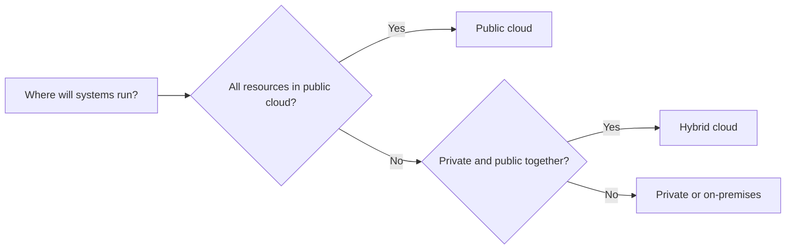

# Cloud computing and deployment models

[← Domain 1](README.md) · [Next: Shared responsibility →](shared-responsibility.md)

## What is cloud computing?

**Cloud computing** is the delivery of computing resources, such as **processing power, storage, databases and networking**, over a network (often the internet). Instead of purchasing every server yourself, you obtain resources from a provider as needed.

- **On-premises:** your organisation hosts and maintains its own infrastructure.
- **Cloud:** a provider offers computing services from its datacenters.
- **Azure:** Microsoft's cloud platform for building, deploying, hosting and managing services.

### Deployment models

| Model | Meaning | Typical use case | Key trade-off |
|:--|:--|:--|:--|
| **Public cloud** | Cloud resources operated by a provider for multiple customers, with logical isolation | Quick deployment, broad reach, elastic capacity | Less control over physical hardware |
| **Private cloud** | Cloud environment dedicated to one organisation | Strict internal control or specific compliance requirements | Higher ownership or operational responsibility |
| **Hybrid cloud** | Combines on-premises/private infrastructure with public cloud | Gradual migration, retain some systems on-premises | More integration complexity |
| **Multicloud** | Uses cloud services from two or more providers | Avoid dependence on one provider or use specialised capabilities | More tooling and skills to manage |

> [!IMPORTANT]
> **Hybrid** describes *where workloads run* (private/on-premises plus public). **Multicloud** describes *how many cloud providers are used*. A solution can be both.

### Azure Arc (hybrid and multicloud)

Azure Arc extends Azure management and governance capabilities to eligible servers, Kubernetes clusters and other resources **outside Azure**. For example, a team may use Azure management tools with on-premises servers. Arc does **not** automatically move those machines into Azure.

## Decision guide

> [!TIP]
> When an exam question combines existing local infrastructure with Azure, look for **hybrid**. When it mentions **multiple cloud providers**, look for **multicloud**.
