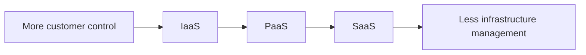

# IaaS, PaaS and SaaS

[← Cloud benefits](cloud-benefits.md) · [← Domain 1](README.md) · [Continue to Domain 2 →](../02-Azure-Architecture-and-Services/README.md)

Cloud **service models** describe how much of the technology stack the provider manages for you.

| Feature | **IaaS** | **PaaS** | **SaaS** |
|:--|:--|:--|:--|
| Full name | Infrastructure as a Service | Platform as a Service | Software as a Service |
| You primarily manage | Guest OS, apps, data, configuration | Your app/code, data and configuration | Users, data and application settings |
| Control | **Most** of these three | Medium | **Least** of these three |
| Infrastructure maintenance | Provider | Provider | Provider |
| Example | Azure Virtual Machines | Azure App Service, Azure Functions | Microsoft 365 |
| Ideal for | Lift-and-shift, custom OS needs, legacy apps | Developers deploying code without server management | Using ready-made applications |

## Infrastructure as a Service (IaaS)

- Rent virtualised infrastructure while retaining extensive OS and app control.
- The provider maintains physical hardware and the virtualisation platform.
- The customer typically configures and patches the **guest operating system**, applications and data.

**Scenario:** A company must install a particular Windows Server application and manage system configuration → **Azure VM (IaaS)**.

## Platform as a Service (PaaS)

- The provider also operates the application hosting platform and its underlying OS.
- Developers focus on application code, settings and data.
- Useful for web hosting and development without managing virtual machines.

**Scenario:** A team wants to deploy a website without patching its server OS → **Azure App Service (PaaS)**.

## Software as a Service (SaaS)

- The provider delivers a usable application.
- The customer manages accounts, access, data and settings within its responsibilities.
- Usually requires the **least infrastructure administration**, not “zero security responsibility”.

**Scenario:** A business needs cloud-hosted email and collaboration → **Microsoft 365 (SaaS)**.

### Memory aid

> [!IMPORTANT]
> **Serverless** means the platform manages server provisioning and scaling for you; it does not mean that servers cease to exist. Azure Functions is a common serverless compute example.
