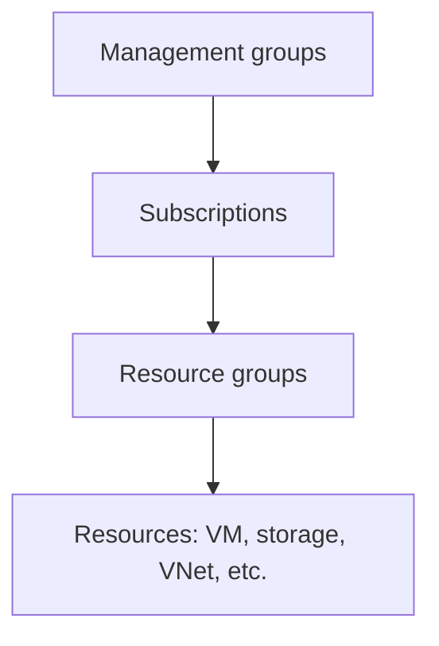

# Azure core architecture and resource hierarchy

[← Domain 2](README.md) · [Next: Compute →](compute.md)

## What is Azure?

**Microsoft Azure** is a cloud platform that provides services for building, deploying and managing applications and infrastructure, including compute, networking, databases, analytics, identity and storage.

## Physical infrastructure

| Component | Definition | Exam clue |
|:--|:--|:--|
| **Datacenter** | Physical facility containing computing and networking equipment | Physical servers |
| **Azure region** | A geographical area containing one or more datacenters connected through a low-latency network | Choose deployment geography |
| **Availability zone** | Physically separate group of datacenters within a region, with independent power, cooling and networking | Protect against datacenter-level failure |
| **Region pair** | Two Azure regions that Microsoft pairs for certain resiliency and platform scenarios | Regional resilience design |
| **Sovereign region/cloud** | Cloud environment designed for particular data-residency, legal or government requirements | Regulatory or jurisdictional boundary |

> [!NOTE]
> Availability zones exist **within** a region, not between regions. Not every region or service supports the same availability-zone features.

### Management hierarchy

| Level | Purpose | Example |
|:--|:--|:--|
| **Management group** | Organise multiple subscriptions for governance at scale | Apply policy to an organisation's subscriptions |
| **Subscription** | Billing and access-management boundary | Separate production from development billing |
| **Resource group** | Logical container used to manage resources with a common lifecycle | `rg-web-production` |
| **Resource** | Individual Azure-managed item | VM, VNet, storage account |

### Important relationships

- Each resource belongs to **one resource group at a time**; resources can be moved between groups where supported.
- A resource group belongs to **one subscription**; a subscription can contain many resource groups.
- A subscription can belong to **one management group** in the management group hierarchy.
- Azure resources in a resource group can reside in **different regions**; the group itself has a metadata location.
- **Policies and access assignments** can be applied at hierarchy levels and often inherited by lower scopes.

> [!TIP]
> If departments need separate spending visibility, **subscriptions**, **resource groups** and **tags** can help in different ways. A subscription is a clear billing boundary; a tag adds metadata for cost allocation.

**From your notes:** Azure definition, regions, availability zones, subscriptions and resource groups. **Syllabus supplement:** region pairs, sovereign regions, management groups and inheritance rules.
