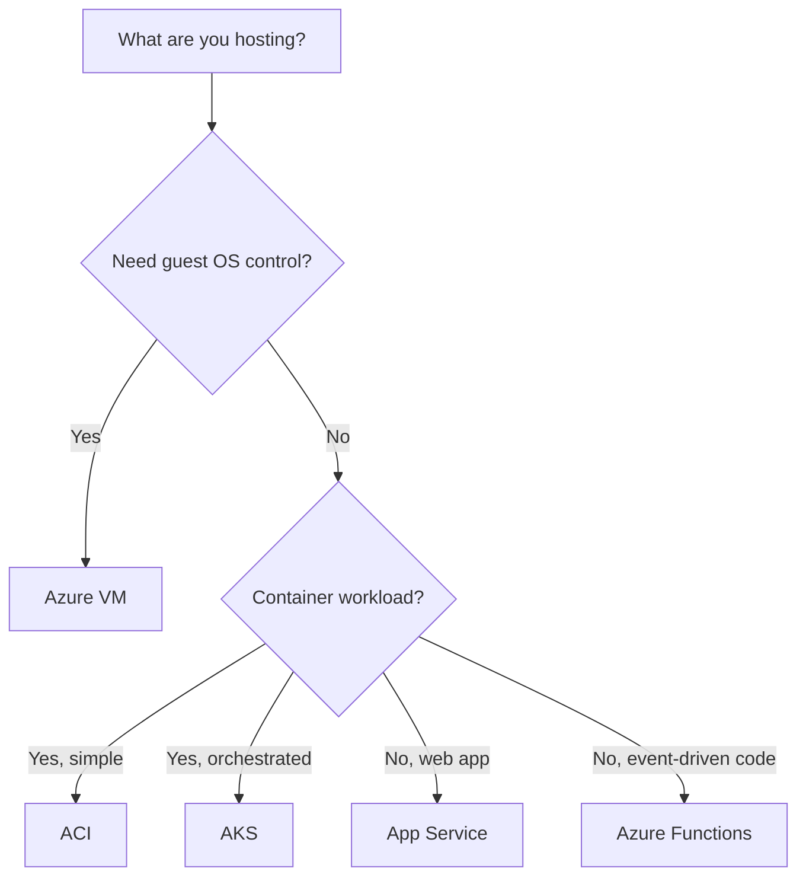

# Azure compute and application hosting

[← Architecture](architecture.md) · [Next: Networking →](networking.md)

Azure provides multiple ways to run workloads. Choose the level of control and operational management you need.

## Compute choices

| Service | Best for | Management responsibility |
|:--|:--|:--|
| **Azure Virtual Machines (VMs)** | Running a custom guest OS and installed software | Customer manages OS and applications |
| **Virtual Machine Scale Sets (VMSS)** | Running and scaling groups of similar VMs | VM-based deployment and scaling |
| **Availability sets** | Spreading VMs across fault and update domains | VM resiliency against certain failures |
| **Azure App Service** | Hosting web applications and APIs | PaaS: no guest OS management |
| **Azure Functions** | Event-driven or scheduled code execution | Serverless platform; billing depends on plan |
| **Azure Container Instances (ACI)** | Running containers without managing an orchestrator | Simple managed container execution |
| **Azure Kubernetes Service (AKS)** | Orchestrating containers across a cluster | Managed Kubernetes control plane, with customer workload responsibilities |
| **Azure Virtual Desktop (AVD)** | Virtual Windows desktops and applications | Centralised desktop experience |
| **Azure Batch** | Scheduling large-scale parallel jobs | Managed job scheduling and compute pools |

## Virtual machines and availability

- A VM typically needs a **size**, **operating system image**, **storage**, **virtual networking**, and suitable identity/security configuration.
- **VM Scale Sets:** manage and potentially autoscale groups of VMs.
- **Availability sets:** distribute VMs among fault and update domains inside a datacenter environment; they are **not the same as availability zones**.
- **Availability zones:** physically separate datacenter groups within a supported region.

## Containers vs VMs

| Virtual machine | Container |
|:--|:--|
| Includes a full guest OS environment | Shares a host OS kernel; packages the app and dependencies |
| More OS control and isolation overhead | Often starts faster and is lighter-weight |
| Best for workloads requiring a specific OS installation | Best for portable, consistent app deployment |

### Simple hosting decision

> [!TIP]
> VMSS = **many similar VMs at scale**. AKS = **Kubernetes-managed containers**. Azure Functions = **event-driven serverless code**. App Service = **managed web apps**.

**Official scope:** [AZ-900 skills: Compute and networking](https://learn.microsoft.com/en-us/credentials/certifications/resources/study-guides/az-900).
