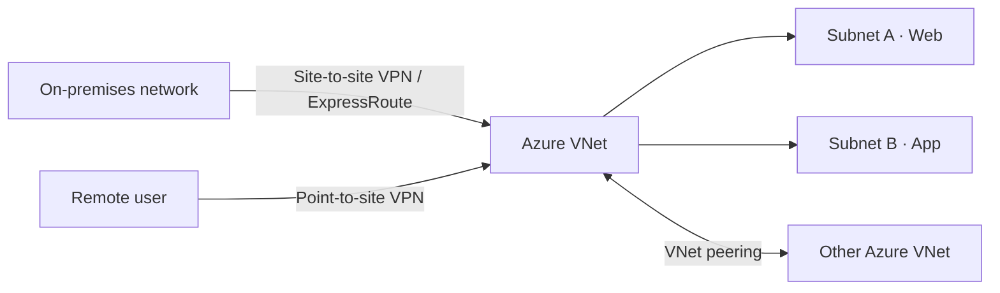

# Azure networking services

[← Compute](compute.md) · [Next: Storage →](storage.md)

## Virtual networks and subnets

An **Azure Virtual Network (VNet)** is a private networking foundation for Azure resources. **Subnets** divide a VNet address space into smaller address ranges, helping with organisation, isolation and routing.

Key capabilities: resource-to-resource communication, internet connectivity (when configured), access to on-premises environments, traffic routing and filtering, and VNet-to-VNet connectivity.

### CIDR subnet example

| Item | Correct value |
|:--|:--|
| Network | `192.168.0.0/24` |
| Subnet mask | `255.255.255.0` |
| Addresses in block | 256 (`192.168.0.0`–`192.168.0.255`) |
| Usable hosts in a conventional on-premises IPv4 `/24` subnet | Usually 254 |
| **Azure subnet reserved addresses** | **5 per subnet** (so a `/24` Azure subnet ordinarily has **251 assignable IPs**) |

## Public vs private connectivity

- **Private IP / private endpoint:** address within a private network; a private endpoint uses a private IP to reach a supported Azure service privately.
- **Public IP / public endpoint:** reachable via public internet routing *if access rules permit*. A public endpoint is **not inherently open to anyone**; authentication and network controls still apply.
- **VNet peering:** connects Azure VNets through Microsoft's network backbone.

## On-premises to Azure

| Connection | What it does | Key exam distinction |
|:--|:--|:--|
| **Point-to-site VPN** | Connects an individual client device to an Azure VNet | Remote user/device |
| **Site-to-site VPN** | Connects an on-premises network to an Azure VNet using an encrypted IPsec tunnel | Network-to-network via public internet |
| **VNet-to-VNet VPN** | Connects VNets using VPN gateways | Encrypted tunnel between Azure virtual networks |
| **Azure ExpressRoute** | Private connectivity through a connectivity provider | **Not dependent on ordinary public internet routing**; not automatically encrypted |
| **VNet peering** | Direct Azure VNet connectivity on Microsoft's backbone | No VPN gateway needed for ordinary peering |

> [!TIP]
> **Private dedicated connectivity** → ExpressRoute. **Encrypted tunnel over internet** → VPN Gateway. **Direct Azure VNet connection** → VNet peering.

## Azure DNS and related services

| Service | Main purpose |
|:--|:--|
| **Azure DNS** | Host and manage public DNS zones/records using Azure infrastructure |
| **Azure Private DNS** | Resolve domain names privately in connected VNets |
| **Azure Front Door** | Global application delivery and HTTP(S) routing, acceleration and failover |
| **Network security group (NSG)** | Permit/deny inbound and outbound traffic based on security rules |

### Network diagram

**my notes:** VNet/subnet, endpoints, VPN types, ExpressRoute, Azure DNS and Front Door. **Corrections:** subnet mask, Azure address reservations, public access nuance, ExpressRoute encryption nuance.
