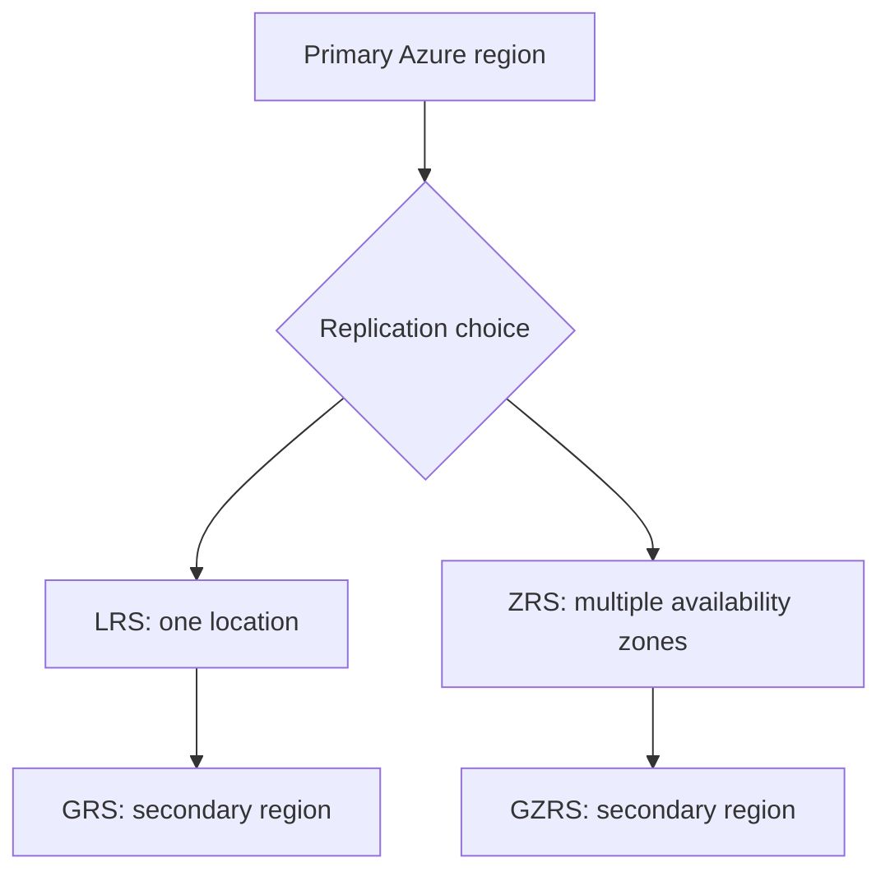

# Azure Storage redundancy

[← Storage](storage.md) · [Next: Migration →](migration.md)

Redundancy keeps additional copies of data to improve **durability** and **availability**. The exact options supported depend on the storage service, account and region.

## Key redundancy options

| Option | Name | Where replicas are kept | Protects against |
|:--|:--|:--|:--|
| **LRS** | Locally redundant storage | Multiple copies within a single physical location/datacenter in the primary region | Hardware failures within that location |
| **ZRS** | Zone-redundant storage | Copies across availability zones within a supported primary region | An availability-zone outage |
| **GRS** | Geo-redundant storage | LRS in primary region plus asynchronous replication to another region | Region-level disaster recovery scenarios |
| **GZRS** | Geo-zone-redundant storage | ZRS in primary region plus asynchronous replication to another region | Zone and regional failure scenarios |
| **RA-GRS** | Read-access GRS | Like GRS, with read access to secondary replica | Secondary reads before failover, where supported |
| **RA-GZRS** | Read-access GZRS | Like GZRS, with read access to secondary replica | Secondary reads before failover, where supported |

## What the options do **not** guarantee

- **GRS/GZRS secondary replication is asynchronous.** There can be a replication delay; these options do not guarantee zero data loss during a regional failover.
- A secondary region is not automatically writable or immediately available for every operation. Failover/access behaviour depends on the service and configuration.
- **Replication is not the same as backup.** Accidental deletions or data corruption can also replicate. Use versioning, soft delete, backup and retention controls as appropriate.

> [!TIP]
> **LRS = one location; ZRS = several zones in one region; GRS = two regions; GZRS = zones plus a second region.** `RA-` means eligible **read access** to secondary data.
