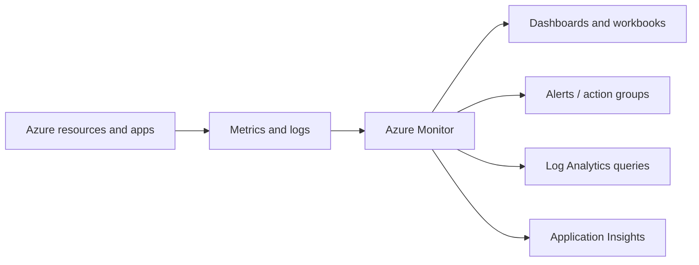

# Azure monitoring, health and recommendations

[← Deployment](deployment-and-management.md) · [← Domain 3](README.md) · [Continue to exam prep →](../04-Exam-Preparation/README.md)

## Which monitoring tool do you need?

| Tool | Main use | Exam clue |
|:--|:--|:--|
| **Azure Advisor** | Best-practice recommendations for cost, reliability, security, performance and operational excellence | “How can I improve this deployment?” |
| **Azure Monitor** | Collect, analyse, visualise and act on Azure/application telemetry | “Collect metrics and logs” |
| **Log Analytics** | Query and analyse logs in a Log Analytics workspace | “Query collected logs using KQL” |
| **Azure Monitor alerts** | Trigger notifications/actions from monitored conditions | “Notify when metric exceeds threshold” |
| **Application Insights** | Application performance management and diagnostic telemetry | “Why is this web app slow?” |
| **Azure Service Health** | Personalised information about Azure incidents, planned maintenance and health advisories affecting your services/regions | “Is Azure having an incident affecting us?” |
| **Azure Resource Health** | Status/history of an individual Azure resource | “Is this particular VM healthy?” |

## Azure Advisor

Advisor evaluates configuration and telemetry and suggests improvements across commonly used categories such as **reliability, security, performance, operational excellence and cost**.

> [!WARNING]
> Advisor is **not itself a security incident response platform**. It can surface configuration recommendations, but continuous threat detection and protection are different functions.

## Azure Monitor

- **Metrics:** numeric time-series measurements such as CPU percentage.
- **Logs:** event or diagnostic records queried/analysed for investigation.
- **Alerts:** evaluate configured rules and notify/trigger supported actions.
- **Application Insights:** analyse app requests, failures, dependencies and performance telemetry, subject to configuration.

## Service Health vs Resource Health

- **Service Health:** Azure platform incidents or planned maintenance that could affect your services.
- **Resource Health:** health state of a **specific resource**, such as a VM.

> [!TIP]
> “Azure outage in a region?” → **Service Health**. “One VM has failed?” → **Resource Health**. “Web app latency trending up?” → **Application Insights**. “Recommend a cheaper VM?” → **Advisor**.

**From your notes:** Advisor, Azure Monitor, alerts, Log Analytics and Application Insights. **Syllabus supplement:** Service Health / Resource Health distinctions.
