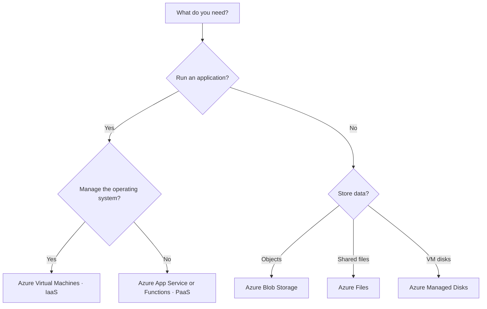

  

  # Microsoft Azure Fundamentals (AZ-900)
  **Clear, structured, exam-focused notes based on handwritten study materials.**

  
  
  
  

> [!IMPORTANT]
> This is an **independent study resource**, not an official Microsoft publication. The structure follows Microsoft's **AZ-900 skills measured as of July 20, 2026**. Azure services, names, features, prices, and exam requirements can change. 

## Domain Structure

| Domain | Exam weighting | What you'll learn | Open notes |
|:--|:--:|:--|:--|
| **01 · Cloud Concepts** | **25–30%** | Cloud models, responsibility, benefits, IaaS/PaaS/SaaS | [Study Domain 1](01-Cloud-Concepts/README.md) |
| **02 · Architecture & Services** | **35–40%** | Azure infrastructure, compute, networks, storage, migration, identity, security | [Study Domain 2](02-Azure-Architecture-and-Services/README.md) |
| **03 · Management & Governance** | **30–35%** | Pricing, policies, deployment tools, monitoring | [Study Domain 3](03-Azure-Management-and-Governance/README.md) |
| **04 · Exam Preparation** | Revision | Comparison tables, practice questions, last-minute revision | [Revision hub](04-Exam-Preparation/README.md) |

## How I used this repository

1. **Read a domain in order.** Follow the `Next →` links at the bottom of each chapter.
2. **Study the comparison tables.** AZ-900 tests when you would choose one service rather than another.
3. **Review the `Exam tip` and `Watch out` callouts.** They identify common distractors and misconceptions.

## Study checklist

- [ ] Describe cloud computing and cloud deployment models
- [ ] Explain the shared responsibility model
- [ ] Explain availability, scalability, reliability, predictability, and consumption pricing
- [ ] Compare IaaS, PaaS and SaaS
- [ ] Describe regions, availability zones, subscriptions and resource groups
- [ ] Compare Azure compute and app-hosting options
- [ ] Describe virtual networking, VPN, ExpressRoute and endpoints
- [ ] Compare Azure Storage services, tiers and redundancy
- [ ] Explain migration options and identity/security controls
- [ ] Explain Azure cost management and governance tools
- [ ] Explain deployment, hybrid management, monitoring and service health
- [ ] Complete practice questions and review mistakes

## Key Azure decision flow

### Helpful official links

- [Microsoft's AZ-900 exam study guide](https://learn.microsoft.com/en-us/credentials/certifications/resources/study-guides/az-900)
- [Microsoft Certified: Azure Fundamentals](https://learn.microsoft.com/en-us/credentials/certifications/azure-fundamentals/)
- [Microsoft Learn Azure documentation](https://learn.microsoft.com/en-us/azure/)
- [Azure pricing calculator](https://azure.microsoft.com/en-us/pricing/calculator/)

---

Organised for learning journey.

